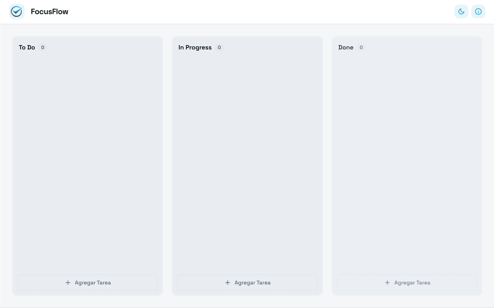

# FocusFlow

Gestión de tareas y flujo de trabajo visual

<div align="center">
  
</div>

<div align="center">
  
  
  
</div>

## Acerca del Proyecto

FocusFlow es una aplicación diseñada para organizar listas y etapas de desarrollo en formato visual. Domina tu día con claridad y gestiona tus tareas de forma eficiente, permitiendo estructurar hitos y organizar las responsabilidades necesarias para llevar a cabo cualquier planificación.

## Características Principales

* **Organización Visual:** Gestión de tareas mediante un flujo de trabajo intuitivo.
* **Control de Hitos:** Define y sigue los puntos clave de tus proyectos.
* **Interfaz Adaptable:** Experiencia fluida tanto en escritorio como en dispositivos móviles.
* **Diseño Profesional:** Estética limpia orientada a la productividad.

## Captura de Pantalla



## Tecnologías Utilizadas

* [HTML5](https://developer.mozilla.org/es/docs/Web/HTML)
* [CSS3](https://developer.mozilla.org/es/docs/Web/CSS) - Tailwind CSS
* [JavaScript](https://developer.mozilla.org/es/docs/Web/JavaScript) - ES6+

## Demo en Vivo

Puedes ver la aplicación funcionando aquí: [[Enlace a Vercel]]

## Estructura del Proyecto

```text
FocusFlow/
├── assets/
│   ├── icons/
│   │   └── logo.ico
│   └── images/
│       └── logo.png
├── css/
│   └── styles.css
├── js/
│   ├── main.js
│   └── tailwind-config.js
├── index.html
└── README.md
```

## Instalación

1. Clona el repositorio:
   ```bash
   git clone https://github.com/ricard020/focusflow.git
   ```
2. Abre el archivo `index.html` en tu navegador favorito.

## Autor

- **Ricardo** - [GitHub](https://github.com/ricard020)

## Licencia

Este proyecto se encuentra bajo la Licencia MIT.
